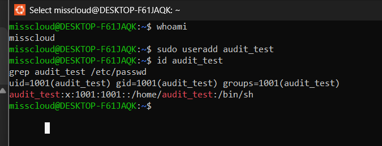
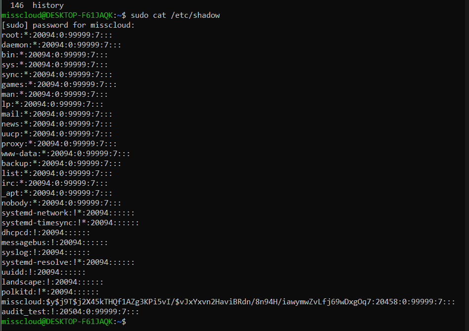
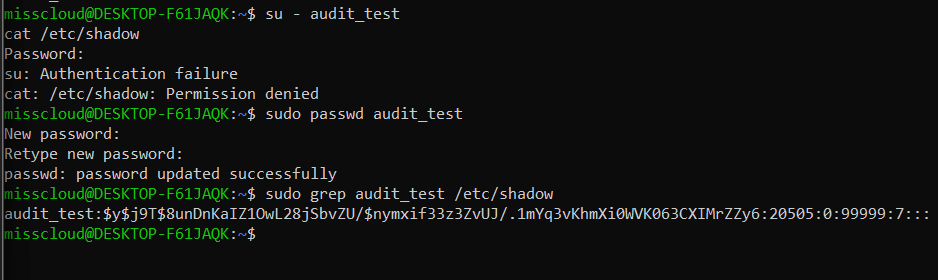
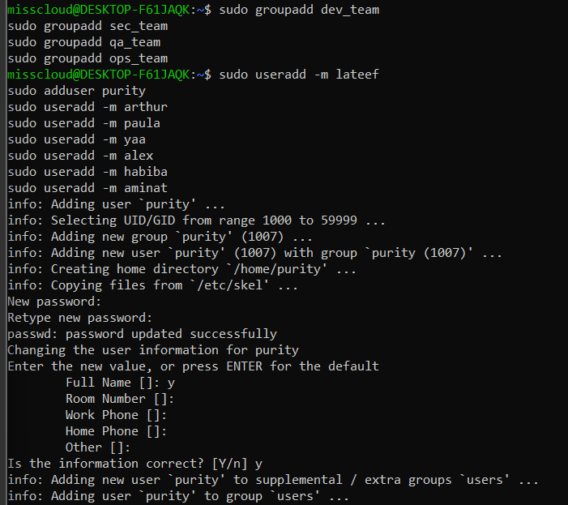
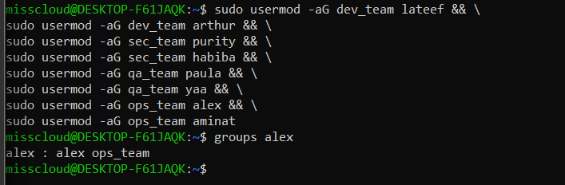
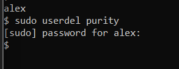

<h2 align="center">DevSecOps Linux User & Access Control</h2>

## Overview

This repository documents the execution of a scenario-based Linux security assessment focused on:

- Password state investigation and remediation  
- User and department-based access control  
- Least privilege enforcement  
- Service account hardening  
- Privilege escalation control  

All tasks were performed entirely in the Linux terminal and validated using system-level verification.

# SCENARIO 1 – Password State Investigation & Remediation

## Part A – Create a User Without a Password

### Command

```bash
sudo useradd audit_test
```

### Verification

```bash
id audit_test
grep audit_test /etc/passwd
```

### Evidence



### Explanation

The user was successfully created.  
User identity information is stored in `/etc/passwd`.  
The `x` in the password field indicates that authentication data is stored separately in `/etc/shadow`.


## Part B – Identify Users Without Passwords

### Inspect Password Storage

```bash
sudo cat /etc/shadow
```

### Before Remediation



### Observation

```
audit_test:!:20504:0:99999:7:::
```

Meaning:

- `!` indicates the account has no active password.
- Password hashes are stored in `/etc/shadow`.
- This file is readable only by root.

Security validation:

```bash
su - audit_test
cat /etc/shadow
```

Result:

```
Permission denied
```

This confirms proper privilege separation.

---

## Part C – Remediation

### Set Password

```bash
sudo passwd audit_test
```

### Verify Password Hash

```bash
sudo grep audit_test /etc/shadow
```

### After Remediation



After setting the password, the entry changes to a hashed value beginning with $y$ indicating yescrypt password hashing algorithm, a modern memory-hard hashing method used in current Linux distributions.

### Security Conclusion

Linux separates identity management (`/etc/passwd`) from authentication storage (`/etc/shadow`), improving overall system security.

---

# SCENARIO 2 – DevSecOps User & Department Access Configuration

## Create Department Groups

```bash
sudo groupadd dev_team
sudo groupadd sec_team
sudo groupadd qa_team
sudo groupadd ops_team
```

### Evidence



Group information is stored in `/etc/group`.

---

## Create Users

```bash
sudo useradd -m lateef
sudo adduser purity
sudo useradd -m arthur
sudo useradd -m paula
sudo useradd -m yaa
sudo useradd -m alex
sudo useradd -m habiba
sudo useradd -m aminat
```

---

## Assign Department Membership

```bash
sudo usermod -aG dev_team lateef
sudo usermod -aG dev_team arthur

sudo usermod -aG sec_team purity
sudo usermod -aG sec_team habiba

sudo usermod -aG qa_team paula
sudo usermod -aG qa_team yaa

sudo usermod -aG ops_team alex
sudo usermod -aG ops_team aminat
```

Verification:

```bash
groups alex
```

### Evidence



## Create Service Account (Non-Login)

```bash
sudo useradd -r -s /usr/sbin/nologin ci_runner
```

Service accounts use non-login shells to:

- Prevent interactive access  
- Reduce attack surface  
- Enforce least privilege  

---

## Grant Sudo to One ops_team Member

```bash
sudo usermod -aG sudo alex
sudo passwd alex
```

Verification:

```bash
su - alex
sudo whoami
```

Expected output:

```
root
```

### Evidence


Only `alex` has elevated privileges. All other users remain restricted.


## Remove User but Preserve Home Directory

```bash
sudo userdel purity
```

### Evidence



The home directory was preserved for:

- Audit traceability  
- Compliance requirements  
- Forensic investigation  
- Data retention policies  


# Technical Summary

## Linux Account Storage Architecture

| File | Purpose |
|------|----------|
| `/etc/passwd` | User identity data |
| `/etc/shadow` | Password hashes |
| `/etc/group` | Group membership |
| `/etc/sudoers` | Privilege escalation control |


## DevSecOps Principles Demonstrated

- Least Privilege  
- Role-Based Access Control  
- Password State Auditing  
- Service Account Hardening  
- Controlled Privilege Escalation  
- Audit Preservation  


## Professional Reflection

This assessment simulated a real-world DevSecOps onboarding and security audit scenario.

Through direct system configuration and validation, the following were demonstrated:

- Secure user lifecycle management  
- Access boundary enforcement  
- Authentication file inspection  
- Service account hardening  
- Controlled privilege escalation  

